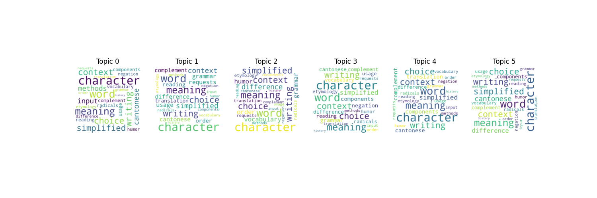
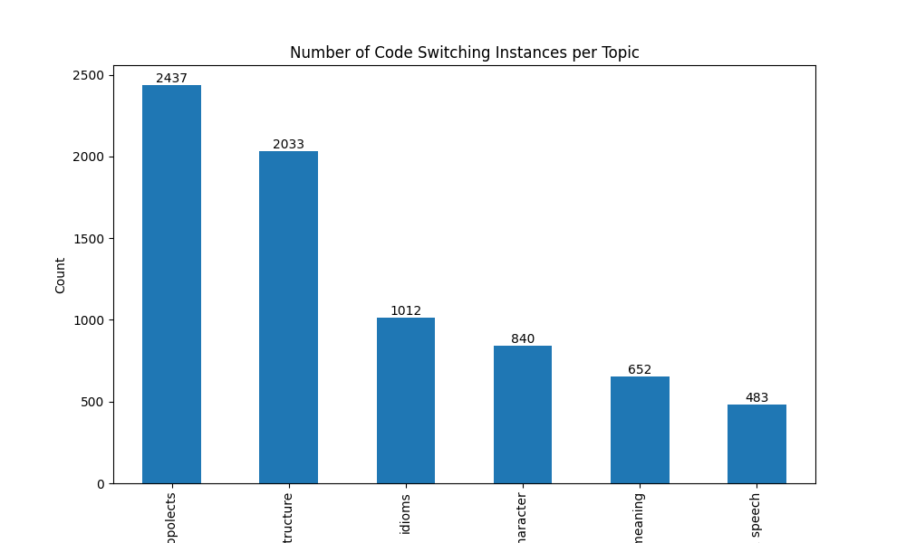
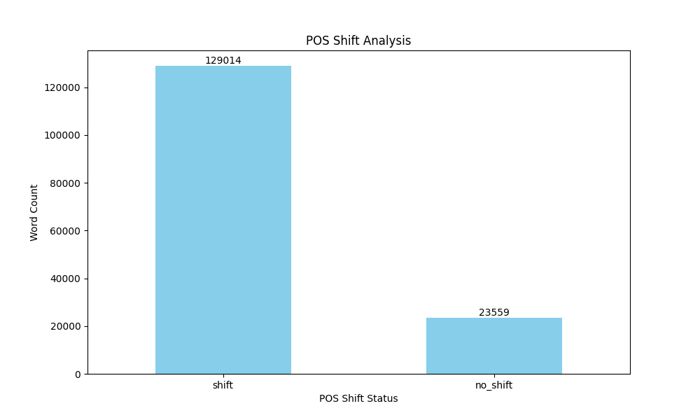

# Chinese-English Code-Switching Analysis

**Author:** Qidu Fu  
**Date:** April 26, 2025

## Table of Contents
1. [Introduction and Overview](#introduction-and-overview)
2. [Project History and Process](#project-history-and-process)
3. [Data Collection and Preprocessing](#data-collection-and-preprocessing)
4. [Analysis Methodology](#analysis-methodology)
5. [Results](#results)
6. [Discussion](#discussion)
7. [Challenges and Setbacks](#challenges-and-setbacks)
8. [Conclusion](#conclusion)

## Introduction and Overview

The phenomenon of **code-switching**, where multilingual speakers alternate between languages within a conversation, is a common occurrence in multilingual environments (Tulloch et al., 2023). Code-switching serves as a means of bridging language gaps, providing  culturally relevant expressions, or adapting to social dynamics. This project investigates **Chinese-English code-switching** in posts on a Chinese-language Stack Exchange site, aiming to quantify the frequency of such occurrences and to examine the impact of contextual factors, particularly the topics, on the use of code-switching. This study contributes to the growing body of research on multilingual communication patterns in online communities.

**Keywords:** Chinese-English, code-switching, Stack Exchange, multilingual communication, online communities

## Project History and Process

The project originated from the need to better understand the linguistic dynamics of multilingual online communities. The main objective was to examine Chinese-English code-switching and determine how context/topics affects the frequency and patterns of code-switching.

### Initial Setbacks and Adjustments
The project encountered several initial challenges:
- **Data Collection:** The Stack Exchange API’s rate-limiting restrictions delayed the retrieval of the large dataset required for analysis. Optimized request strategies, such as batching requests and using pagination, were implemented to minimize downtime and ensure comprehensive data gathering. In addition, initial experiments using web scraping on a different multilingual forum were attempted using `BeautifulSoup`, and other two datasets were gathered, although these datasets were not used.  For specific code and process, see [0_collect_data](https://nbviewer.org/github/Data-Science-for-Linguists-2025/Chinese-English-Code-Switching-Analysis/blob/ff9caf7466e974b2a63627bd47a40c5941afd29a/notebooks/0_collect_data.ipynb) and [1.1_collect_data](https://nbviewer.org/github/Data-Science-for-Linguists-2025/Chinese-English-Code-Switching-Analysis/blob/ff9caf7466e974b2a63627bd47a40c5941afd29a/notebooks/1.1_collect_data.ipynb).
- **Data Preprocessing:** The dataset required extensive cleaning, such as URLs,  HTML encoding to Chinese/English characters, and others. This process proved to be time-consuming and required multiple iterations of data cleaning to achieve a usable dataset. For specific code, see [1.2_process_data](https://nbviewer.org/github/Data-Science-for-Linguists-2025/Chinese-English-Code-Switching-Analysis/blob/ff9caf7466e974b2a63627bd47a40c5941afd29a/notebooks/1.2_process_data.ipynb).

## Data Collection and Preprocessing

Data for this analysis was obtained using the Stack Exchange API, which allowed for the extraction of posts from a Chinese-language focused forum. The dataset consists of both **questions** and **tags** where multilingual users alternated between Chinese and English. Due to the nature of code-switching in multilingual discourse, the dataset was especially challenging to process due to the frequent mixing of languages in single posts. For specific code, see [1.1_collect_data](https://nbviewer.org/github/Data-Science-for-Linguists-2025/Chinese-English-Code-Switching-Analysis/blob/ff9caf7466e974b2a63627bd47a40c5941afd29a/notebooks/1.1_collect_data.ipynb).

### Key Steps in Data Preprocessing:
1. **Data Collection:** A total of **12,401 posts** were retrieved from Stack Exchange using its API.
2. **Data Cleaning:** Posts were cleaned by checking and removing URLs, converting HTML encoding to Chinese/English characters, and checking and removing non-Chinese/english characters.
3. **Text Tokenization:** The text data was tokenized into individual words (along with their POS and NER) and sentences using the `stanza` library. 
4. **Sample Data:** A randomly selected sample of 1000 rows was extracted from the dataset to test the effectiveness of the preprocessing pipeline and ensure that the code-switching instances were accurately identified and labeled. For specifics, see [1.2_process_data](https://nbviewer.org/github/Data-Science-for-Linguists-2025/Chinese-English-Code-Switching-Analysis/blob/ff9caf7466e974b2a63627bd47a40c5941afd29a/notebooks/1.2_process_data.ipynb).

The cleaned and tokenized dataset is now ready for more advanced analysis, including language detection, topic modeling, and part-of-speech (POS) shifting analysis.

## Analysis Methodology

To analyze the occurrence of code-switching and its relationship with contextual factors, I employed a combination of **language detection**, **statistical modeling**, and **linguistic analysis**. The methodology included several key steps, as outlined below:

1. **Language Detection:** Initially, language detection libraries such as `langdetect` and `langid` were employed to identify code-switching instances by detecting the language of individual sentences within posts. However, both libraries struggled with short sentences which most of the text data in this dataset were. Therefore, a **regular expression (regex)** approach was implemented to better detect and label code-switching. For specifics, see [2.1_analyze_data.ipynb](https://nbviewer.org/github/Data-Science-for-Linguists-2025/Chinese-English-Code-Switching-Analysis/blob/main/notebooks/2.1_analyze_data.ipynb).
   
2. **Topic Modeling:** Clustering techniques, such as **KMeans** and **Latent Dirichlet Allocation (LDA)**, were applied to identify the topics discussed in the posts. The former was used to identify the number of clusters/topics, and the latter was used to for identify the topics for each post. After assigning the topics to the posts, I used the WordCloud to plot the 30 words in each topic, inspected the standard deviations of the each topics' top words, and manually conducted a thematic analysis and put forward topic names. These techniques allowed for an exploration of whether code-switching frequencies varied by topic. For specifics, see [2.1_analyze_data.ipynb](https://nbviewer.org/github/Data-Science-for-Linguists-2025/Chinese-English-Code-Switching-Analysis/blob/main/notebooks/2.1_analyze_data.ipynb).

**Figure 1. WordCloud of top words in each topic**

3. **Frequency Analysis:** A detailed **frequency count** of code-switching instances across various domains was conducted. The focus was to understand if code-switching occurs more frequently in different topics. The aim was to observe whether topic (situational code-switching) influenced the occurrence of code-switching. For specifics, see [2.1_analyze_data.ipynb](https://nbviewer.org/github/Data-Science-for-Linguists-2025/Chinese-English-Code-Switching-Analysis/blob/main/notebooks/2.1_analyze_data.ipynb).

4. **Part-of-Speech Shifting:** Using **POS tagging** performed by the `stanza` library, the analysis aimed to identify whether code-switching was associated with shifts in word classes (e.g., noun to verb) between the prior word and the CS word. For specifics, see [2.2_analyze_data.ipynb](https://nbviewer.org/github/Data-Science-for-Linguists-2025/Chinese-English-Code-Switching-Analysis/blob/main/notebooks/2.2_analyze_data.ipynb).

These methodologies provided a comprehensive approach to examining how code-switching is manifested in various contexts.

## Results

### Dataset Overview
The dataset consists of **12,041 posts** with no missing values. Key statistics recorded during the data processing phase are as follows:

| Feature                         | Value             |
|------------------------------------|-------------------|
| **Total Posts**                    | 12,041            |
| **Word Tokens**                    | 152,573           |
| **Sentence Count**                 | 13,664            |
| **Average Word Count per Sentence**| 10.54 words      |

### Code-Switching Frequency
The frequency of code-switching was analyzed across various domains within the posts. The results revealed that code-switching was most prevalent in the following contexts:

| Topic                           | Frequency Count |
|-----------------------------------|-----------------|
| **Characters, synonyms, topolects** | 2,437           |
| **Word choice, phrase, structure** | 2,033           |
| **Idioms**                         | 1,012           |
| **Mandarin character usage**      | 840             |
| **Grammar and meaning**           | 652             |
| **Writing versus speech**         | 483             |

**Figure 2. Number of code-switching instances per topic**

### Statistical Analysis
A **Kruskal-Wallis H test** was employed to assess whether code-switching frequencies differed significantly across the identified domains. The Kruskal-Wallis H test is a non-parametric test used to compare more than two groups when the assumptions of normality and homogeneity of variance are not met. 

The null hypothesis of the Kruskal-Wallis test is that the distributions of code-switching frequencies across the domains are identical, while the alternative hypothesis suggests that at least one domain differs significantly from the others. The **p-value** for the test was **0.415**, which is above the significance threshold of 0.05, indicating that the differences in code-switching frequencies across domains are not statistically significant.

The test results suggest that code-switching occurs consistently across the domains, indicating that it is a general feature of multilingual communication in this context, rather than being constrained to specific discourse types.

### Part-of-Speech Shifting
The analysis of POS shifts (between the prior word and the CS word) revealed the following:

| POS Shift             | Frequency Count |
|-----------------------|-----------------|
| **No Shift**          | 129,014         |
| **Shift**             | 23,559          |

**Figure 3. Number of POS (non-)shifting in CS words**  

In the dataset, the majority of code-switching instances did not involve a shift in POS, suggesting that code-switching primarily occurs at the lexical level. The shifting examples, such as the translation of 陈子昂's name from a proper noun (**N**) to the verb (**V**) phrase "Need help to translate" or the use of "我" in Li Bai's poetry lines, highlight cases where a POS change occurs within the switch. For instance, "Usage of ""我"" in Li Bai's lines '东风随春归，发我枝上花'" moves from a preposition (**Prep**) to a pronoun (**Pro**) in the context of a specific literary usage.

On the other hand, non-shifting examples such as the use of "老板" in video game contexts or "我" in Li Bai’s lines show instances where code-switching occurs without a change in POS. These examples are consistent with the idea that much of the observed code-switching involves lexical borrowing, where the switch between languages or registers does not necessarily entail a syntactic transformation. The shift or lack thereof in POS suggests that the lexical nature of code-switching is prominent in this dataset, with most instances maintaining syntactic coherence within the sentence structure despite switching between languages.

## Discussion

The results of the analysis suggest that **code-switching** is a common and frequent feature of multilingual communication on Stack Exchange. Despite analyzing various domains/topics, no significant difference in code-switching frequency was found, implying that the act of switching between Chinese and English is a regular feature of multilingual communication in this online community, regardless of the topic discussed. This finding disagrees with **situational code-switching**, where external factors such as setting and social dynamics influence language choice (Bassiouney, 2020), is prevalent in online discourse, regardless of the specific subject matter.

The **POS shifting** analysis also suggests that while code-switching is often lexical, there are instances in which a shift in word class occurs, further indicating the complexity of code-switching behavior in multilingual contexts.

## Challenges and Setbacks

Several challenges were encountered during the execution of the project:
- **API Rate Limiting:** The Stack Exchange API’s rate limiting delayed data collection. Optimized strategies were implemented to work within the rate limits, but delays were inevitable.
- **Data Preprocessing:** Due to inconsistent formatting, significant time was required to clean and preprocess the dataset. Multiple rounds of data cleaning were necessary.
- **Language Detection Errors:** The language detection tools used initially (langdetect and langid) were unable to accurately classify mixed-language sentences. A **regular expression-based approach** was implemented to improve detection accuracy.

Despite these setbacks, the project was completed successfully, and the analysis provides valuable insights into multilingual communication in online spaces.

## Conclusion

This study sheds light on the phenomenon of **Chinese-English code-switching** in posts on Stack Exchange. The results indicate that code-switching is a frequent and consistent feature of multilingual communication, unaffected by the domain of discourse. Additionally, while most code-switching instances are lexical, with the marjority involving shifts in POS, suggesting a complex interplay of factors influencing code-switching behavior.

The findings highlight the importance of computational methods, such as language detection, topic modeling, and POS tagging, in studying multilingual discourse. Future research can build on this research by expanding the dataset, exploring more domains, and investigating the cognitive and social implications of code-switching in online communities.

---

For further details on the code and analysis, see the following Jupyter Notebooks:
- 0_collect_data.ipynb [github](notebooks/0_collect_data.ipynb) | [nbviewer](https://nbviewer.org/github/Data-Science-for-Linguists-2025/Chinese-English-Code-Switching-Analysis/blob/ff9caf7466e974b2a63627bd47a40c5941afd29a/notebooks/0_collect_data.ipynb)
- 1.1_collect_data.ipynb [github](notebooks/1.1_collect_data.ipynb) | [nbviewer](https://nbviewer.org/github/Data-Science-for-Linguists-2025/Chinese-English-Code-Switching-Analysis/blob/ff9caf7466e974b2a63627bd47a40c5941afd29a/notebooks/1.1_collect_data.ipynb)
- 1.2_process_data.ipynb [github](notebooks/1.2_process_data.ipynb) | [nbviewer](https://nbviewer.org/github/Data-Science-for-Linguists-2025/Chinese-English-Code-Switching-Analysis/blob/ff9caf7466e974b2a63627bd47a40c5941afd29a/notebooks/1.2_process_data.ipynb)
- 2.1_analyze_data.ipynb [github](notebooks/2.1_analyze_data.ipynb) | [nbviewer](https://nbviewer.org/github/Data-Science-for-Linguists-2025/Chinese-English-Code-Switching-Analysis/blob/main/notebooks/2.1_analyze_data.ipynb)
- 2.2_analyze_data.ipynb [github](notebooks/2.2_analyze_data.ipynb) | [nbviewer](https://nbviewer.org/github/Data-Science-for-Linguists-2025/Chinese-English-Code-Switching-Analysis/blob/main/notebooks/2.2_analyze_data.ipynb)

## References and Additional Readings
- Bassiouney, R. (2020). *Arabic sociolinguistics: Topics in diglossia, gender, identity, and politics*. Georgetown University Press.
- Montanari S, Ochoa W, & Subrahmanyam K. (2019). A longitudinal investigation of language mixing in Spanish–English dual language learners: The role of language proficiency, variability, and sociolinguistic factors. *Journal of Child Language*, 1, 1–25. https://doi.org/10.1017/S0305000919000278
- Quick, A. E., Lieven, E., Carpenter, M., & Tomasello, M. (2018). Identifying partially schematic units in the code-mixing of an English and German speaking child. *Linguistic Approaches to Bilingualism*, 8(4), 477–501. https://doi.org/10.1075/lab.15049.qui
- Tulloch, M. K., & Hoff, E. (2023). Filling lexical gaps and more: Code-switching for the power of expression by young bilinguals. *Journal of Child Language*, 50(4), 981–1004. https://doi.org/10.1017/S0305000922000307
